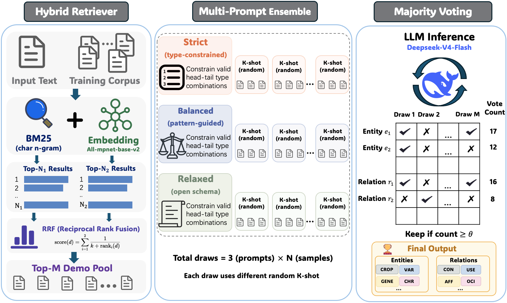

# RAME：检索增强多Prompt集成的小杂粮育种信息抽取方法

> [CCL 2026 评测任务五（MGBIE）杂粮育种信息抽取评测](https://tianchi.aliyun.com/competition/entrance/532465)  
> **不微调 第一名方案**

## 方法概述

RAME（Retrieval-Augmented Multi-Prompt Ensemble）是一个无需训练的 LLM 信息抽取系统，核心思路：

1. **混合检索增强少样本**：BM25 字符 n-gram + 句向量 (all-mpnet-base-v2) 通过 RRF 融合，为每个文档检索最相似的训练样本作为 few-shot 示例。
2. **三Prompt集成**：设计 Strict（严格类型对约束，高精确）、Relaxed（仅语义定义，高召回）、Balanced（常见模式但不穷尽，折中）三种 System Prompt，覆盖精确率-召回率谱。
3. **大规模重复采样 + 多数投票**：每个 Prompt 变体独立采样 N 次（每次随机子采样 K 个示例），共 3×N 次结构化输出，通过投票阈值过滤噪声，保留高置信度实体与关系。



### 核心结果

| 指标 | 分数 |
|------|------|
| NER Score | 0.72986 |
| RE Score | 0.3459 |
| Total Score | **0.4995** |

## 项目结构

```
├── predict.py              # 主入口：RAME 预测流水线
├── model.py                # LLM 客户端（OpenAI 兼容 API）
├── schema.py               # 12 种实体类型 + 6 种关系类型定义
├── prompts.py              # Strict/Relaxed/Balanced 三套 System Prompt
├── tools.py                # JSON 解析、实体对齐、投票聚合、评测指标
├── retriever.py            # BM25 字符 n-gram 检索器
├── embedding_retriever.py  # Embedding 检索器 + Hybrid RRF 融合
├── requirements.txt        # Python 依赖
├── data/                   # 数据目录（需自行放入官方数据）
│   ├── train.json
│   ├── test.json

└── results/                # 输出目录
```

## 环境配置

### 1. 安装依赖

```bash
pip install -r requirements.txt
```

### 2. 配置环境变量

```bash
export MGBIE_BASE_URL="http://localhost:8000/v1"  # sglang/vLLM API 地址
export MGBIE_MODEL="deepseek-ai/DeepSeek-V4-Flash"
export EMBEDDING_MODEL_PATH="sentence-transformers/all-mpnet-base-v2"  # 可选
```

### 3. 准备数据

将官方数据放入 `data/` 目录：
- `data/train.json` — 训练集（1000 条，作为检索 demo 池）
- `data/test.json` — 测试集（600 条）

## 使用方法

### 正式推理（提交评测）

```bash
# Hybrid 检索（BM25 + Embedding RRF 融合，推荐）
python predict.py \
    --input data/test.json \
    --output results/submit.json \
    --pool data/train.json \
    --workers 32 \
    --retriever hybrid \
    --zip results/submit.zip

# BM25-only 检索（无需 GPU 做检索）
python predict.py \
    --input data/test.json \
    --output results/submit.json \
    --pool data/train.json \
    --workers 32 \
    --retriever bm25
```

### 预计算 Embedding 缓存（加速 Hybrid 检索启动）

```bash
python embedding_retriever.py \
    --docs data/train.json \
    --output data/train_embeddings.npy
```

## 超参数配置

| 参数 | 值 | 说明 |
|------|-----|------|
| `N_DRAWS` | 60 | 每个 Prompt 变体的采样次数 |
| `VOTE_THR` | 91 | 投票阈值（≈50% × 3×60 = 180 次总采样） |
| `FEWSHOT_K` | 8 | 每次采样的 few-shot 示例数 |
| `RETRIEVAL_M` | 30 | 检索候选池大小（从中随机抽取 K 个） |
| `TEMPERATURE` | 0.0 | 贪心解码 |
| `MAX_TOKENS` | 65536 | token 预算（推理 + 回答） |
| `ENABLE_THINKING` | True | 开启模型 thinking/reasoning 模式 |

## 评测指标

与官方一致：
- **NER Score** = 0.5 × F1 + 0.25 × P + 0.25 × R
- **RE Score** = 0.5 × F1 + 0.25 × P + 0.25 × R
- **Total** = 0.4 × NER Score + 0.6 × RE Score

## 硬件需求

- **LLM 服务**：8× NVIDIA H20 (96 GB)，通过 sglang 部署 DeepSeek-V4-Flash
- **Embedding 模型**：任意 ≥4 GB 显存 GPU（或 CPU，较慢）
- **推理耗时**：每文档 180 次 LLM 调用，100 条文档约需 ~18,000 次调用

## 引用

```bibtex

```

